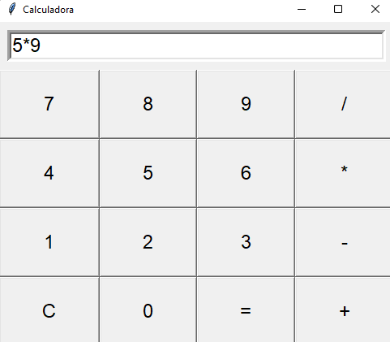
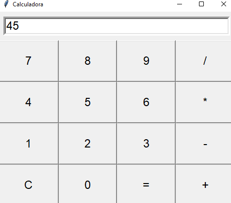

# Interfaz Gráfica Tkinter

_Propietario_: Fabiola Piedra Fallas

En el presente directorio, se utilizó el modulo Tkinter para crear una interfaz gráfica para una calculadora.
Para esto se usó Tkinter que es una biblioteca de phyton especializada para la creación y el desarrollo de interfacez gráficas, además, de que se utilizó una función para las funciones que debe hacer la calculadora, luego se uso un for button in buttons para iterar sobre cada botón a la hora de hacer click en alguno, en este mismo se usa lambda para hacer pasar este valor a la función on_click, luego se hace la creación del botón con el tk.button, luego a este mismo se coloca en un grid, y se usa el col_val para pasar de una columna a otra.

## Instrucciones de uso

¿Qué hay que tener instalado para ejecutar el programa?

py calculadora.py 

# Demostración de ejecución 

